# Neural Machine Translator GRU
## 설명
Tatoeba Project의 English-French 문장 쌍 데이터를 사용하여 GRU 기반의 기계 번역 모델을 제작합니다.
본 코드에서는 attention과 [scheduled sampling](https://arxiv.org/pdf/1506.03099.pdf) 사용 유무 따른 기계 번역 모델을 제작할 수 있습니다.
GRU 기반 기계 번역 모델과 이 모델의 attention에 대한 설명은 [Sequence-to-Sequence (Seq2Seq) 모델과 Attention](https://ljm565.github.io/contents/RNN2.html)을 참고하시기 바랍니다.
또한 본 코드의 attention은 [Bahdanau Attention](https://arxiv.org/pdf/1409.0473.pdf)을 기반으로 구현하였으며, PyTorch의 [seq2seq 튜토리얼](https://tutorials.pytorch.kr/intermediate/seq2seq_translation_tutorial.html)과는 무관합니다.
다른 attention을 사용한 모델을 보고 싶다면 [seq2seq 튜토리얼](https://tutorials.pytorch.kr/intermediate/seq2seq_translation_tutorial.html) 코드를 참고하시기 바랍니다.
<br><br><br>

## 모델 종류
* ### Seqeunce-to-Sequence GRU Model and Attention
    English-French 기계 번역 모델 제작을 위해 GRU 기반의 seq2seq 모델을 학습합니다.
<br><br><br>


## 토크나이저 종류
* ### Word Tokenizer
    단어 기준으로 토큰화(Attention 가시화를 위함).
<br><br><br>

## 사용 데이터
* 실험으로 사용하는 데이터는 [Tatoeba Project](https://www.manythings.org/anki/)의 sentence pair 데이터 중, English-French 데이터셋입니다.
<br><br><br>


## 사용 방법
* ### 학습 방법
    학습을 시작하기 위한 argument는 4가지가 있습니다.<br>
    * [-d --device] {cpu, gpu}, **필수**: 학습을 cpu, gpu로 할건지 정하는 인자입니다.
    * [-m --mode] {train, test, inference}, **필수**: 학습을 시작하려면 train, 학습된 모델을 가지고 있어서 loss, BLEU, attention 모델일 경우 sample에 대한 attention score를 보고싶은 경우에는 test로 설정해야합니다(결과는 result 폴더에 생성 됩니다). 번역기를 테스트 해보고싶다면 inference로 설정해야합니다. test, inference 모드를 사용할 경우, [-n, --name] 인자가 **필수**입니다.
    * [-c --cont] {1}, **선택**: 학습이 중간에 종료가 된 경우 다시 저장된 모델의 체크포인트 부분부터 학습을 시작할 수 있습니다. 이 인자를 사용할 경우 -m train 이어야 합니다. 
    * [-n --name] {name}, **선택**: 이 인자는 -c 1 혹은 -m {test, inference} 경우 사용합니다.
    중간에 다시 불러서 학습을 할 경우 모델의 이름을 입력하고, test, inference를 할 경우에도 실험할 모델의 이름을 입력해주어야 합니다(최초 학습시 config.json에서 정한 모델의 이름의 폴더가 형성되고 그 폴더 내부에 모델 및 모델 파라미터가 json 파일로 형성 됩니다).<br><br>

    터미널 명령어 예시<br>
    * 최초 학습 시
        ```
        python3 main.py -d cpu -m train
        ```
    * 중간에 중단 된 모델 이어서 학습 시
        <br>주의사항: config.json을 수정해야하는 일이 발생 한다면 base_path/config.json이 아닌, base_path/model/{model_name}/{model_name}.json 파일을 수정해야 합니다.
        ```
        python3 main.py -d gpu -m train -c 1 -n {model_name}
        ```
    * 최종 학습 된 모델의 test set에 대한 loss, BLEU 등의 결과 및 attention 결과를 가시화할 시
        <br>주의사항: config.json을 수정해야하는 일이 발생 한다면 base_path/config.json이 아닌, base_path/model/{model_name}/{model_name}.json 파일을 수정해야 수정사항이 반영됩니다.
        ```
        python3 main.py -d cpu -m test -n {model_name}
        ```
    * 최종 학습 된 모델의 test set에 대한 번역 모델을 테스트할 시
        <br>주의사항: config.json을 수정해야하는 일이 발생 한다면 base_path/config.json이 아닌, base_path/model/{model_name}/{model_name}.json 파일을 수정해야 수정사항이 반영됩니다.
        ```
        python3 main.py -d cpu -m inference -n {model_name}
        ```
    <br><br>

* ### 모델 학습 조건 설정 (config.json)
    * **주의사항: 최초 학습 시 config.json이 사용되며, 이미 한 번 학습을 한 모델에 대하여 parameter를 바꾸고싶다면 base_path/model/{model_name}/{model_name}.json 파일을 수정해야 합니다.**
    * is_attn: {0, 1} 중 선택. Attention 모델을 제작한다면 1, 아니면 0. 
    * base_path: 학습 관련 파일이 저장될 위치
    * model_name: 학습 모델이 저장될 파일 이름 설정. 모델은 base_path/model/{model_name}/{model_name}.pt 로 저장.
    * loss_data_name: 학습 시 발생한 loss data를 저장하기 위한 이름 설정. base_path/loss/{loss_data_name}.pkl 파일로 저장. 내부에 중단된 학습을 다시 시작할 때, 학습 과정에 발생한 loss 데이터를 그릴 때 등 필요한 데이터를 dictionary 형태로 저장.
    * vocab_size: 최대 vocab size 설정.
    * max_len: 토큰화 된 리뷰 데이터의 최대 길이.
    * hidden_size: GRU 모델의 hidden dimension.
    * num_layers: GRU 모델의 레이어 수.
    * dropout: 모델의 dropout 비율.
    * batch_size: batch size 지정.
    * epochs: 학습 epoch 설정.
    * lr: learning rate 지정.
    * teacher_forcing_ratio: Teacher forcing (교사 강요) 비율. 1일 경우 모든 학습이 teacher forcing으로 이루어짐(e.g. 0.9일 경우 학습의 step마다 10 %의 확률로 scheduled sampling 방식으로 학습이 진행됨). 
    * result_num: 모델 테스트 시, 결과를 보여주는 sample 개수.
    * early_stop_criterion: Test set의 학습이 최소 loss를 내어준 학습 epoch 대비, 설정된 숫자만큼 epoch이 지나도 나아지지 않을 경우 학습 조기 종료.
    * visualize_attn: {0, 1} 중 선택. 1이면 랜덤으로 result_num에서 설정해준 개수만큼 랜덤으로 attention score를 가시화하여 {base_path}/result 폴더에 모델 이름으로 이미지 저장.
    <br><br><br>


## 결과
* ### Neural Machine Translator GRU 모델별 결과
    * Training Set Loss History<br>
        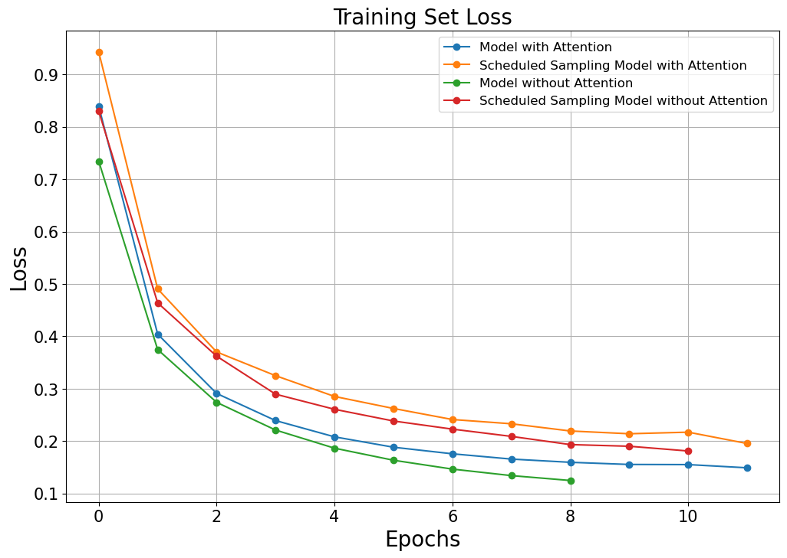<br><br>

    * Test Set Loss History<br>
        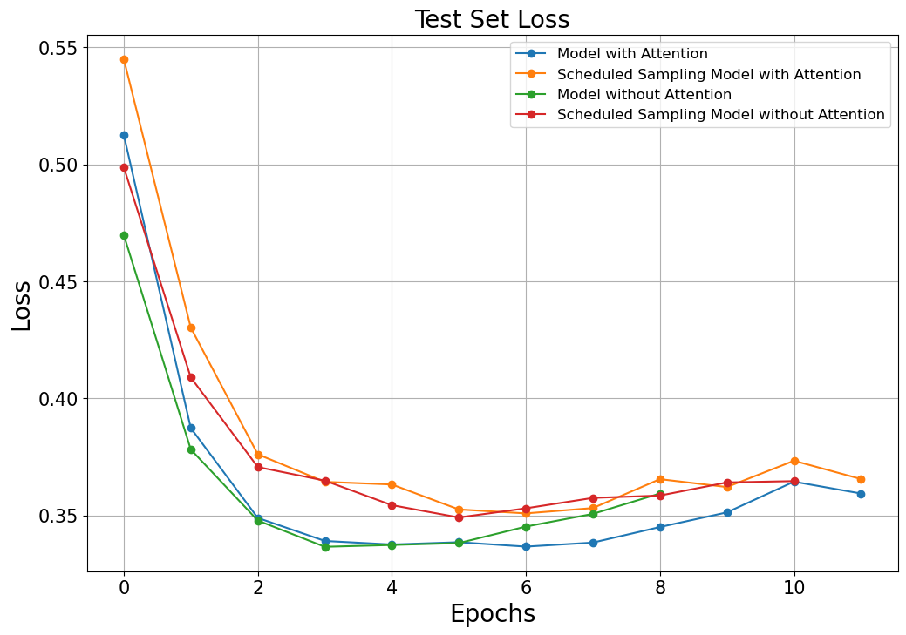<br>
        * Model with Attention: 0.3367
        * Scheduled Sampling Model with Attention: 0.3509
        * Model without Attention: 0.3366
        * Scheduled Sampling Model without Attention: 0.3491<br><br>

    * Test Set Perplexity (PPL) History<br>
        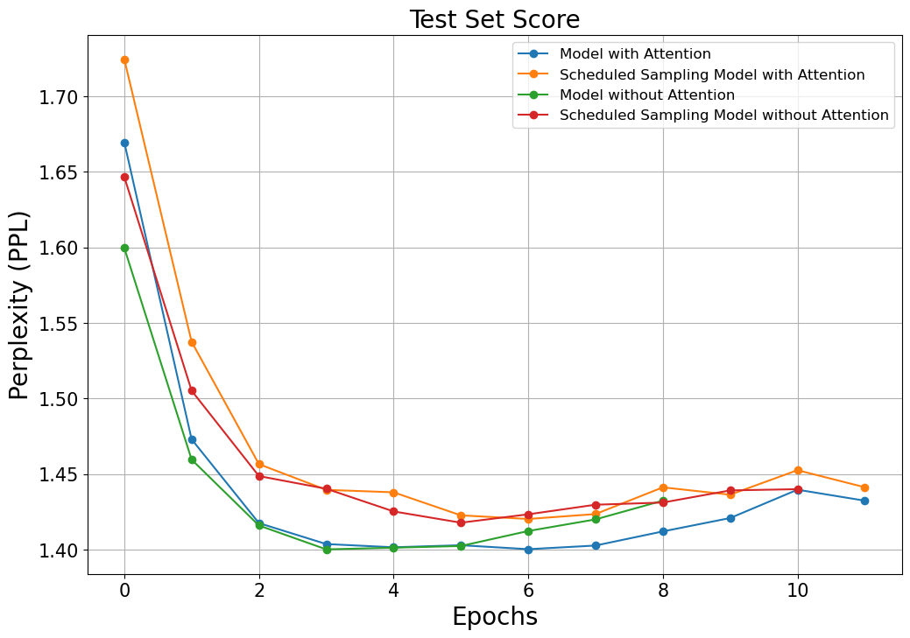<br>
        * Model with Attention: 1.4003
        * Scheduled Sampling Model with Attention: 1.4203
        * Model without Attention: 1.4002
        * Scheduled Sampling Model without Attention: 1.4178<br><br>

    * BLEU-2 Score History<br>
        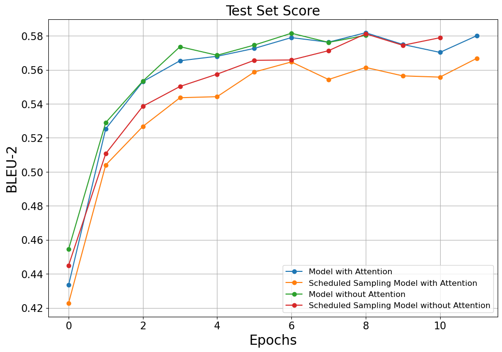<br>
        * Model with Attention: 0.5789
        * Scheduled Sampling Model with Attention: 0.5646
        * Model without Attention: 0.5735
        * Scheduled Sampling Model without Attention: 0.5656<br><br>

    * BLEU-4 Score History<br>
        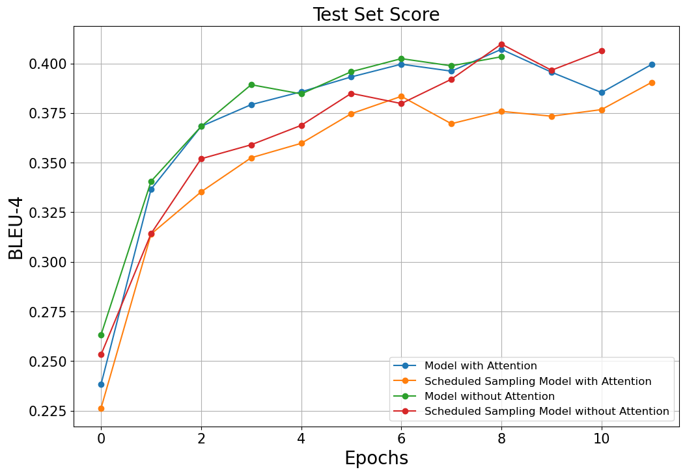<br>
        * Model with Attention: 0.3996
        * Scheduled Sampling Model with Attention: 0.3834
        * Model without Attention: 0.3893
        * Scheduled Sampling Model without Attention: 0.3849<br><br>

    * NIST-2 Score History<br>
        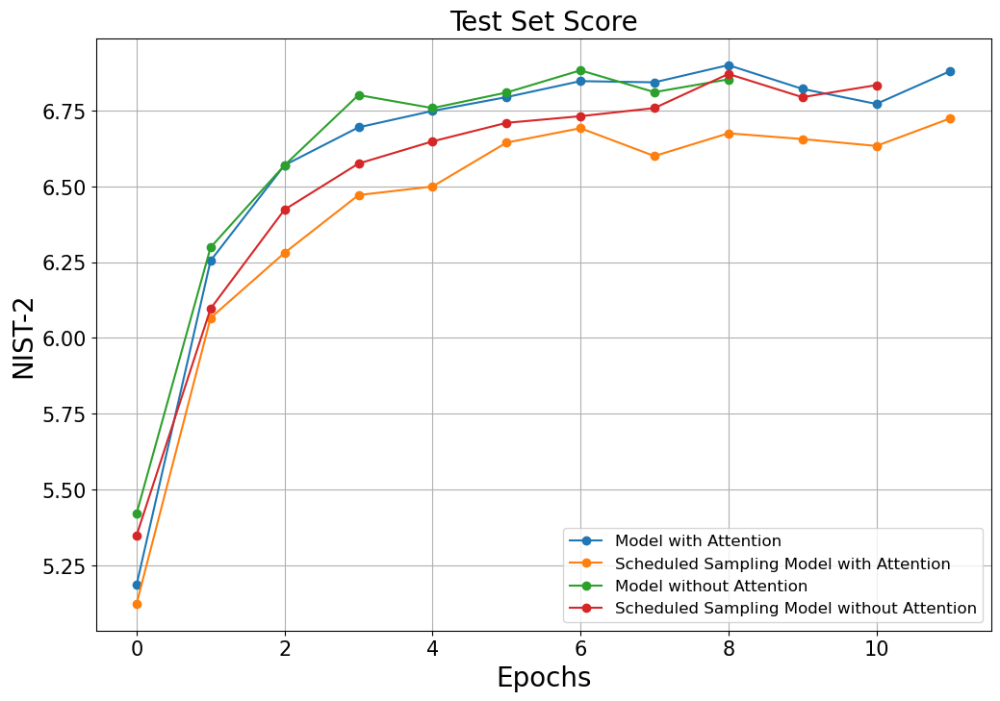<br>
        * Model with Attention: 6.8475
        * Scheduled Sampling Model with Attention: 6.6922
        * Model without Attention: 6.8016
        * Scheduled Sampling Model without Attention: 6.7098<br><br>

    * NIST-4 Score History<br>
        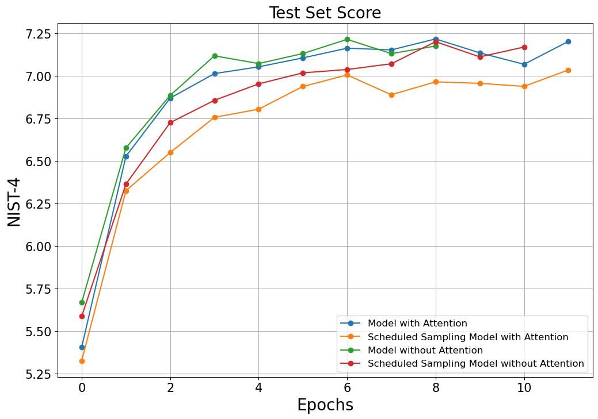<br>
        * Model with Attention: 7.1627
        * Scheduled Sampling Model with Attention: 7.0052
        * Model without Attention: 7.1178
        * Scheduled Sampling Model without Attention: 7.0177<br><br>


    * 기계 번역 결과 샘플<br>
        * Model with Attention
            ```
            # Sample 1
            src : when i was your age , i had a girlfriend .
            gt  : lorsque j'avais votre age , j'avais une petite amie .
            pred: lorsque j'avais votre age , j'avais une petite amie .


            # Sample 2
            src : he gave me some money .
            gt  : il me donna un peu d'argent .
            pred: il me donna un peu d'argent .


            # Sample 3
            src : please answer all the questions .
            gt  : repondez a toutes les questions , s'il vous plait .
            pred: repondez a toutes les questions , s'il vous plait .

            ```
            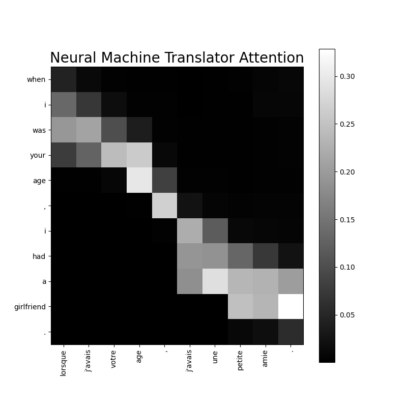
            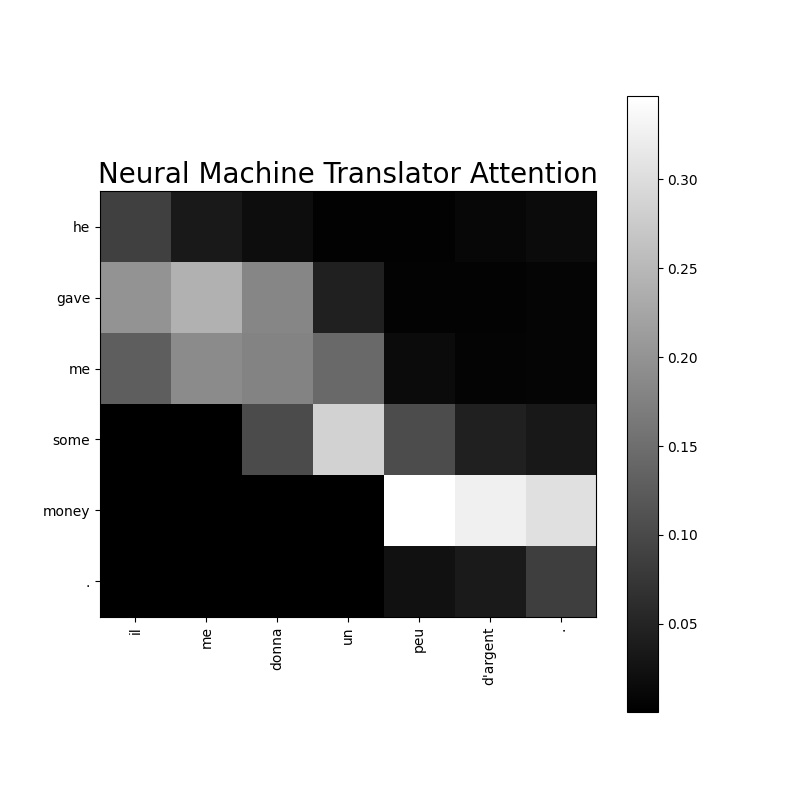
            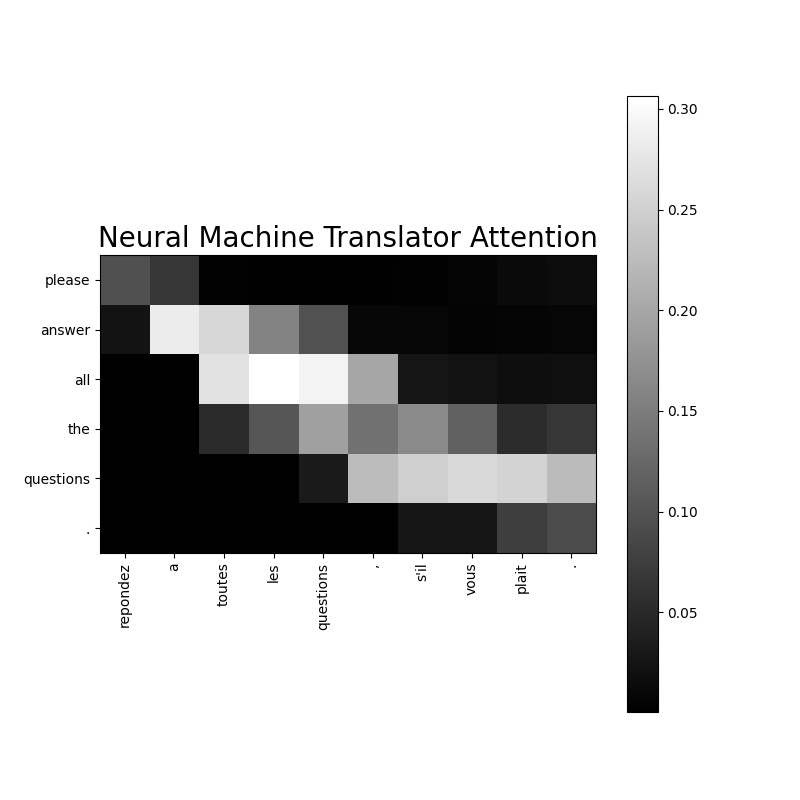<br><br><br>

        * Scheduled Sampling Model with Attention
            ```
            # Sample 1
            src : i'm in love with you and i want to marry you .
            gt  : je suis amoureuse de toi et je veux me marier avec toi .
            pred: je vous amoureux de toi et je veux vous epouser . toi .


            # Sample 2
            src : what's really going one here ?
            gt  : que se passe-t-il vraiment ici ?
            pred: que se passe-t-il, ici ?


            # Sample 3
            src : we do need your advice .
            gt  : il nous faut ecouter vos conseils .
            pred: nous nous faut que tes conseils .

            ```
            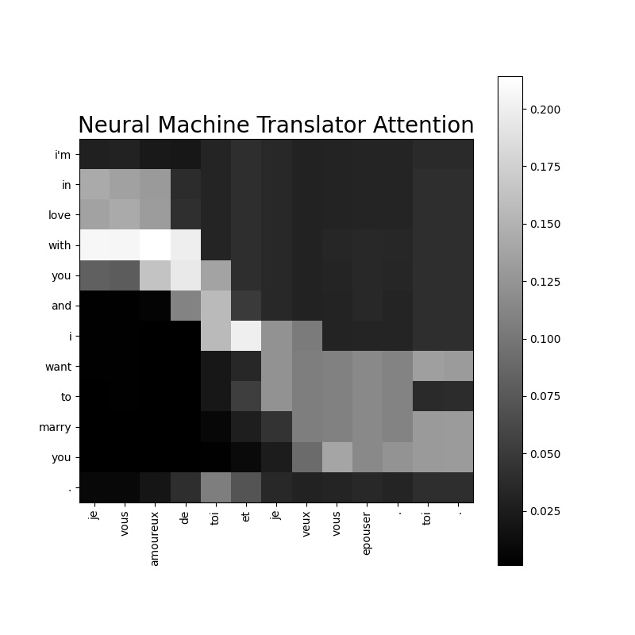
            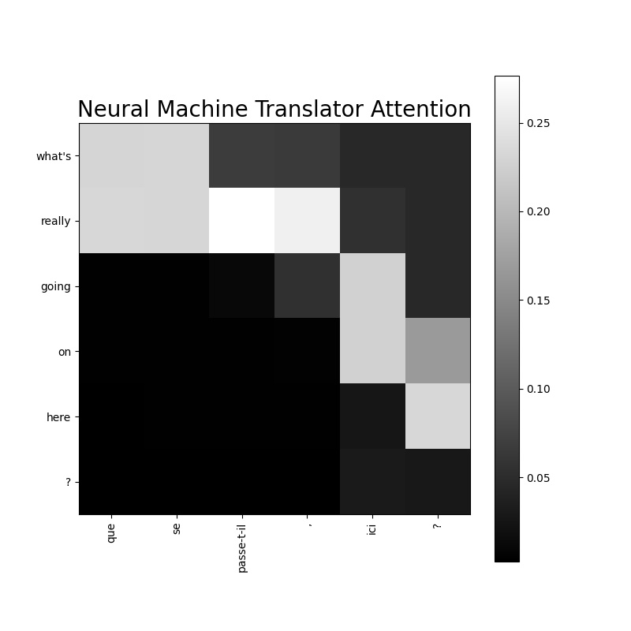
            <br><br><br>

        * Model without Attention
            ```
            # Sample 1
            src : tom asked mary for some help .
            gt  : tom a demande a mary de l'aider .
            pred: tom demande demande a mary de l'aide .


            # Sample 2
            src : you see what i mean ?
            gt  : tu vois ce que je veux dire ?
            pred: tu vois ce que je veux dire ?


            # Sample 3
            src : i haven't talked to you in a while .
            gt  : je ne t'ai pas parle depuis un bon moment .
            pred: je n'ai vous pas parle pendant un moment moment .

            ```
            <br><br>

        * Scheduled Sampling Model without Attention
            ```
            # Sample 1
            src : let's take a little break .
            gt  : faisons une petite pause .
            pred: faisons une pause pause .


            # Sample 2
            src : they live on the [UNK] floor of this [UNK] .
            gt  : ils vivent au [UNK] etage de ces [UNK] .
            pred: ils vivent au sujet de de ce sujets .


            # Sample 3
            src : tom doesn't understand why mary is so popular .
            gt  : tom ne comprend pas pourquoi marie est si populaire .
            pred: tom ne comprend pas pourquoi mary est si populaire .

            ```
            <br><br>


<br><br><br>
