# Neural Machine Translator GRU
한국어 버전의 설명은 [여기](./docs/README_ko.md)를 참고하시기 바랍니다.

## Introduction
We will create a GRU-based machine translation model using the English-French sentence pair data from the Tatoeba Project. This code will allow you to create a machine translation model with or without the use of attention and [scheduled sampling](https://arxiv.org/pdf/1506.03099.pdf).
For an explanation of the GRU-based machine translation model and its attention mechanism, please refer to [Sequence-to-Sequence (Seq2Seq) 모델과 Attention](https://ljm565.github.io/contents/RNN2.html).
Furthermore, the attention in this code is implemented based on [Bahdanau Attention](https://arxiv.org/pdf/1409.0473.pdf) and is not related to the [PyTorch seq2seq tutorial](https://tutorials.pytorch.kr/intermediate/seq2seq_translation_tutorial.html).
If you want to see a model using a different attention mechanism, please refer to the code in the [PyTorch seq2seq tutorial](https://tutorials.pytorch.kr/intermediate/seq2seq_translation_tutorial.html).
<br><br><br>

## Supported Model
### Seqeunce-to-Sequence GRU Model
* A GRU using `nn.GRU` is implemented.
* Bahdanau Attention (You can decide in `config/config.yaml` whether to use attention or not).
<br><br><br>


## Supported Tokenizer
### Custom Word Tokenizer
* Tokenization based on words for attention visualization.
<br><br><br>

## Base Dataset
* Base dataset for tutorial is English-French dataset of [Tatoeba Project](https://www.manythings.org/anki/).
<br><br><br>

## Supported Devices
* CPU, GPU, multi-GPU (DDP), MPS (for Mac and torch>=1.12.0)
<br><br><br>

## Quick Start
```bash
python3 src/run/train.py --config config/config.yaml --mode train
```
<br><br>


## Project Tree
This repository is structured as follows.
```
├── configs                           <- Folder for storing config files
│   └── *.yaml
│
└── src      
    ├── models
    |   └── gru_seq2seq.py            <- GRU model file
    |
    ├── run                   
    |   ├── inference.py              <- Trained model live demo execution code
    |   ├── train.py                  <- Training execution file
    |   ├── validation.py             <- Trained model evaulation execution file
    |   └── vis_attention.py          <- Attention visualization code for each word of attention model
    |
    ├── tools                   
    |   ├── tokenizers
    |   |    └── word_tokenizer.py    <- Word tokenizer file
    |   |
    |   ├── early_stopper.py          <- Early stopper class file
    |   ├── evaluator.py              <- Metric evaluator class file
    |   ├── model_manager.py          
    |   ├── tatoeba_downloader.py     <- Tatoeba data download file  
    |   └── training_logger.py        <- Training logger class file
    |
    ├── trainer                 
    |   ├── build.py                  <- Codes for initializing dataset, dataloader, etc.
    |   └── trainer.py                <- Class for training, evaluating, and calculating accuracy
    |
    └── uitls                   
        ├── __init__.py               <- File for initializing the logger, versioning, etc.
        ├── data_utils.py             <- File defining the custom dataset dataloader
        ├── filesys_utils.py       
        ├── func_utils.py       
        └── training_utils.py     
```
<br><br>


## Tutorials & Documentations
Please follow the steps below to train a GRU translator model.
1. [Getting Started](./docs/1_getting_started.md)
2. [Data Preparation](./docs/2_data_preparation.md)
3. [Training](./docs/3_trainig.md)
4. ETC
   * [Evaluation](./docs/4_model_evaluation.md)
   * [Attention Visualization](./docs/5_vis_attn.md)
   * [Live Demo](./docs/6_live_demo.md)

<br><br><br>


## Training Results
### Each Result of GRU Neural Machine Translator
* Training Set Loss History<br>
    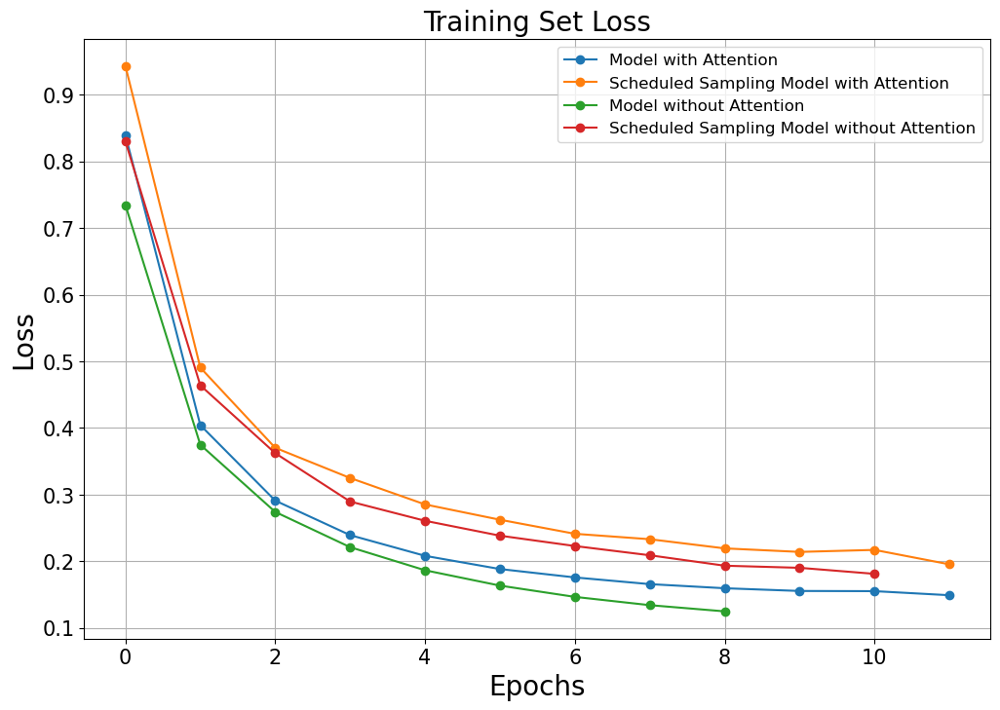<br><br>

* Test Set Loss History<br>
    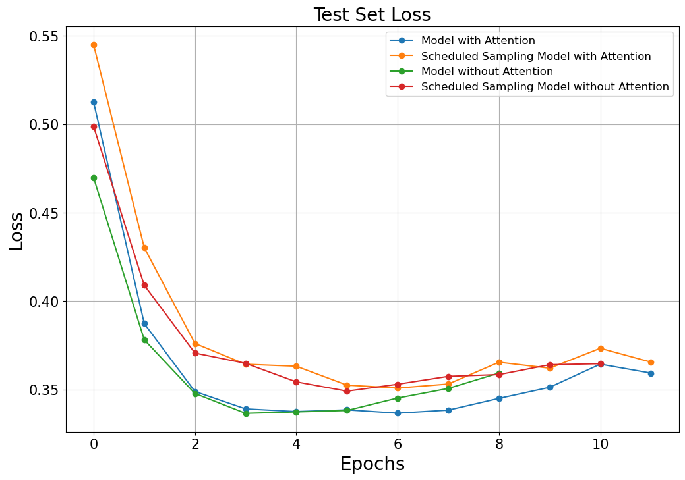<br>
    * Model with Attention: 0.3367
    * Scheduled Sampling Model with Attention: 0.3509
    * Model without Attention: 0.3366
    * Scheduled Sampling Model without Attention: 0.3491<br><br>

* Test Set Perplexity (PPL) History<br>
    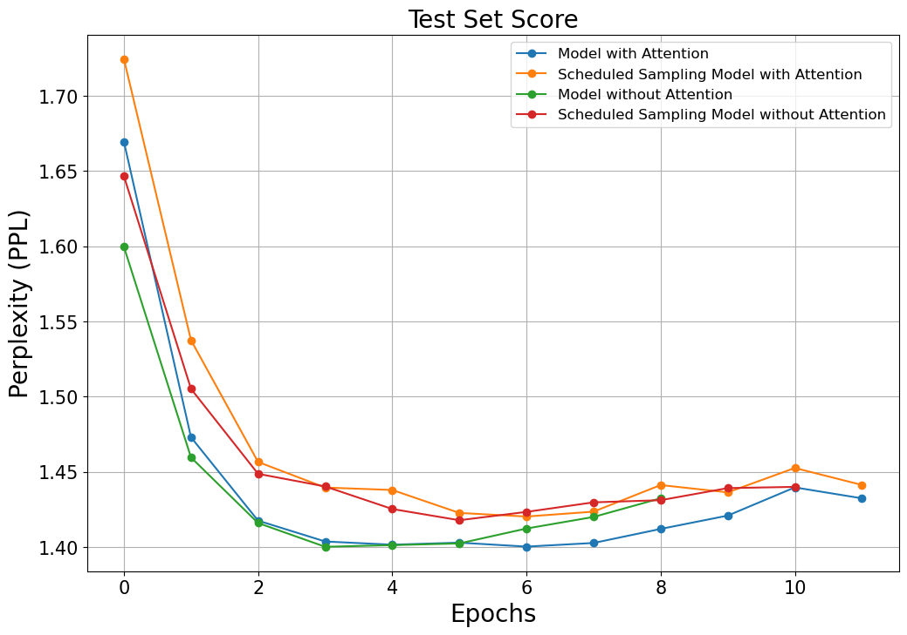<br>
    * Model with Attention: 1.4003
    * Scheduled Sampling Model with Attention: 1.4203
    * Model without Attention: 1.4002
    * Scheduled Sampling Model without Attention: 1.4178<br><br>

* BLEU-2 Score History<br>
    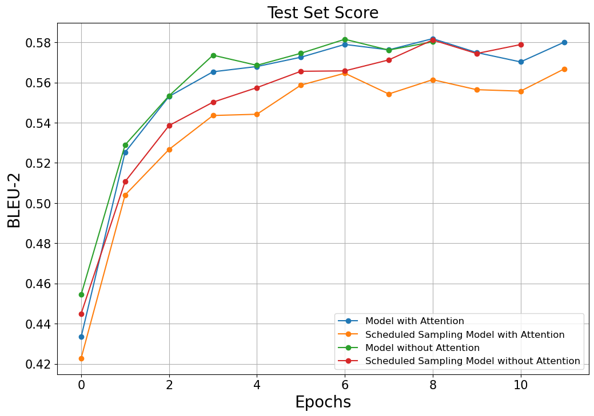<br>
    * Model with Attention: 0.5789
    * Scheduled Sampling Model with Attention: 0.5646
    * Model without Attention: 0.5735
    * Scheduled Sampling Model without Attention: 0.5656<br><br>

* BLEU-4 Score History<br>
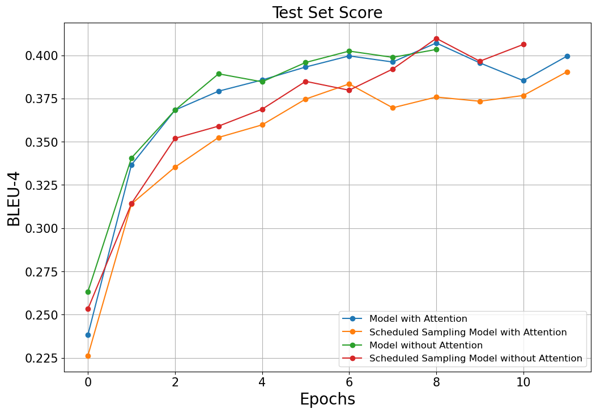<br>
    * Model with Attention: 0.3996
    * Scheduled Sampling Model with Attention: 0.3834
    * Model without Attention: 0.3893
    * Scheduled Sampling Model without Attention: 0.3849<br><br>

* NIST-2 Score History<br>
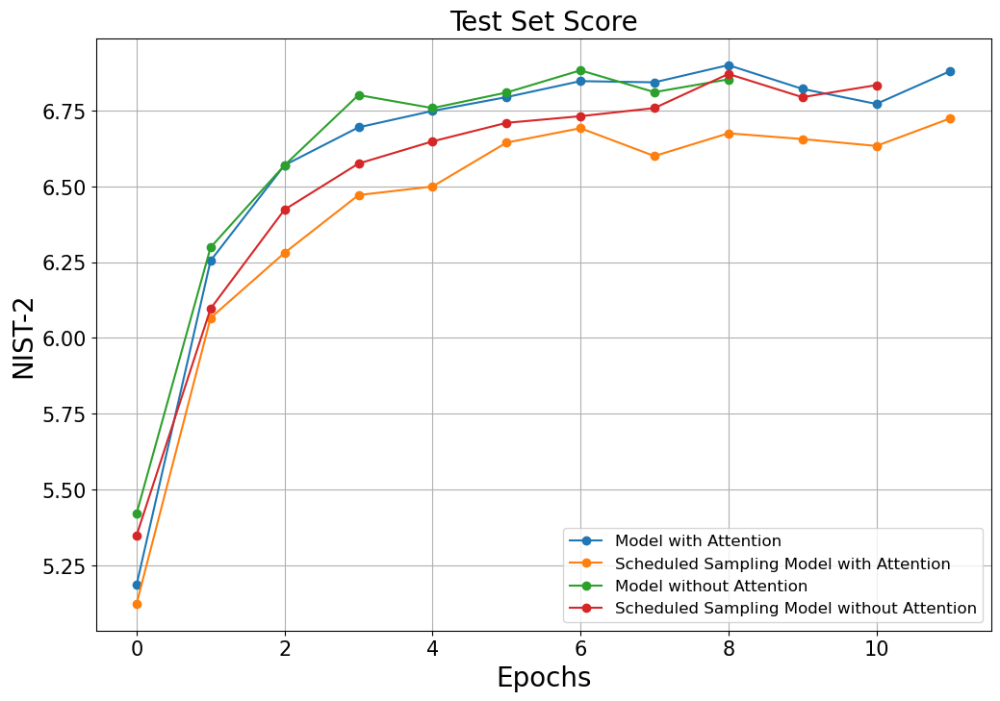<br>
    * Model with Attention: 6.8475
    * Scheduled Sampling Model with Attention: 6.6922
    * Model without Attention: 6.8016
    * Scheduled Sampling Model without Attention: 6.7098<br><br>

* NIST-4 Score History<br>
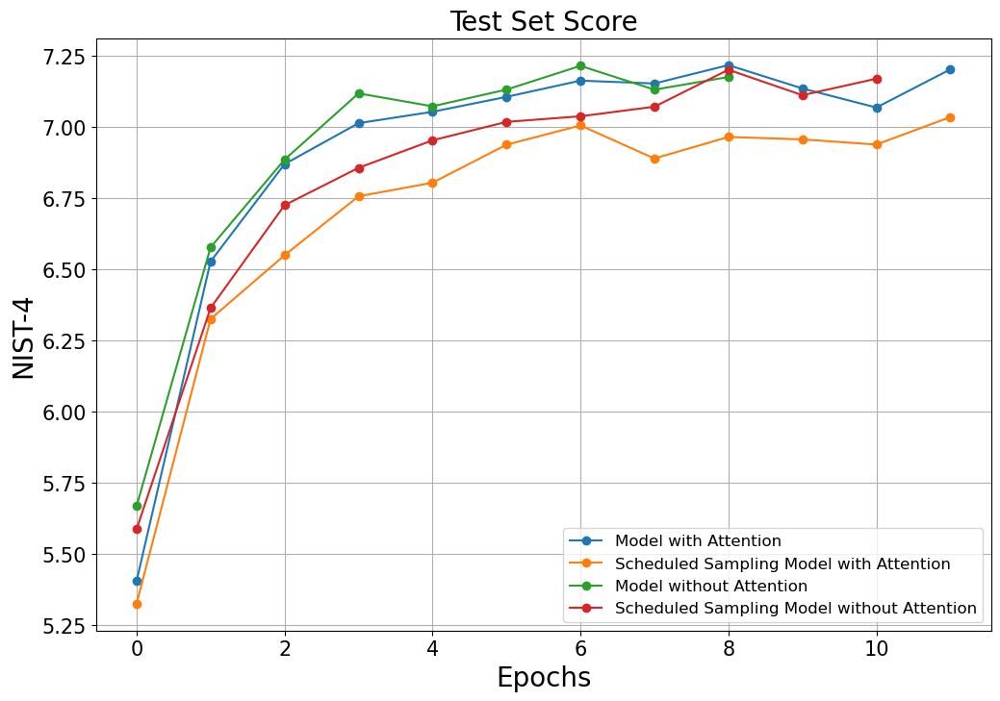<br>
    * Model with Attention: 7.1627
    * Scheduled Sampling Model with Attention: 7.0052
    * Model without Attention: 7.1178
    * Scheduled Sampling Model without Attention: 7.0177<br><br>

### Translated Samples and Attentions of Each GRU Model
* Model with Attention
    ```
    # Sample 1
    src : when i was your age , i had a girlfriend .
    gt  : lorsque j'avais votre age , j'avais une petite amie .
    pred: lorsque j'avais votre age , j'avais une petite amie .


    # Sample 2
    src : he gave me some money .
    gt  : il me donna un peu d'argent .
    pred: il me donna un peu d'argent .


    # Sample 3
    src : please answer all the questions .
    gt  : repondez a toutes les questions , s'il vous plait .
    pred: repondez a toutes les questions , s'il vous plait .

    ```
    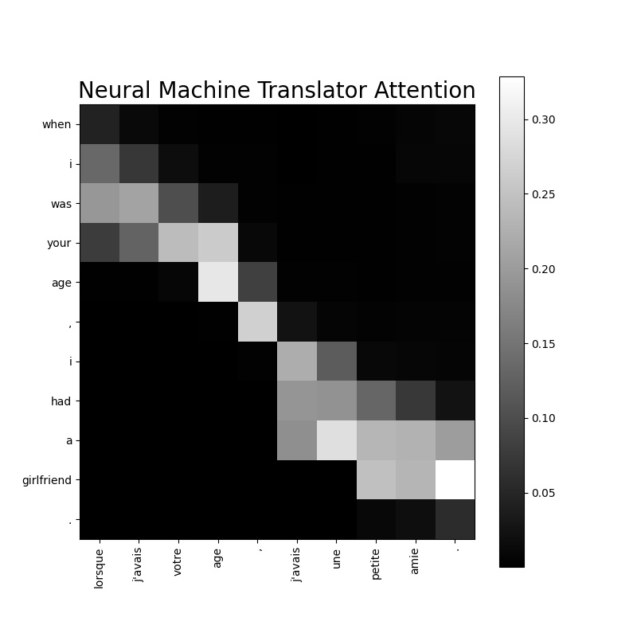
    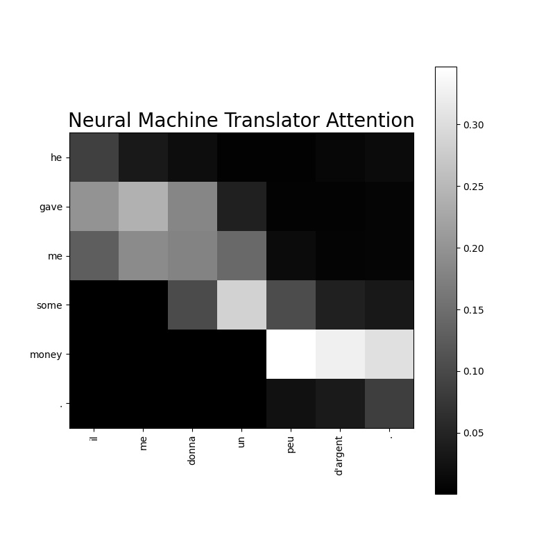
    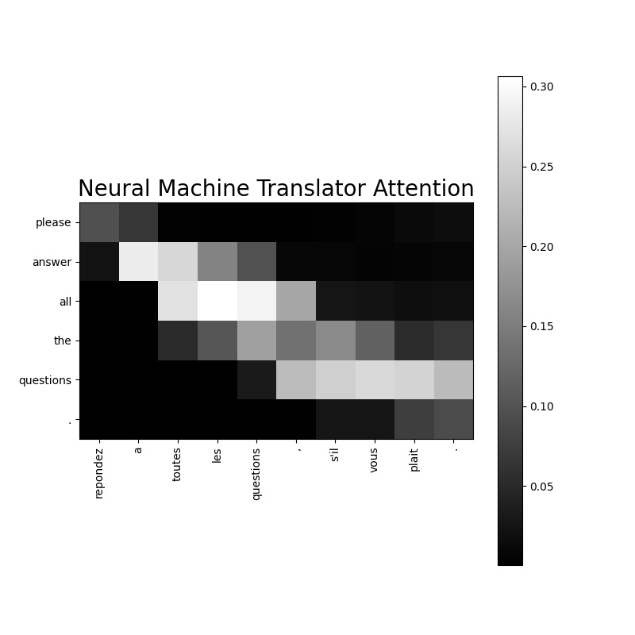<br><br><br>

* Scheduled Sampling Model with Attention
    ```
    # Sample 1
    src : i'm in love with you and i want to marry you .
    gt  : je suis amoureuse de toi et je veux me marier avec toi .
    pred: je vous amoureux de toi et je veux vous epouser . toi .


    # Sample 2
    src : what's really going one here ?
    gt  : que se passe-t-il vraiment ici ?
    pred: que se passe-t-il, ici ?


    # Sample 3
    src : we do need your advice .
    gt  : il nous faut ecouter vos conseils .
    pred: nous nous faut que tes conseils .

    ```
    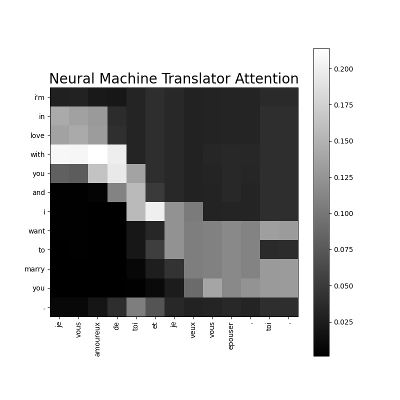
    
    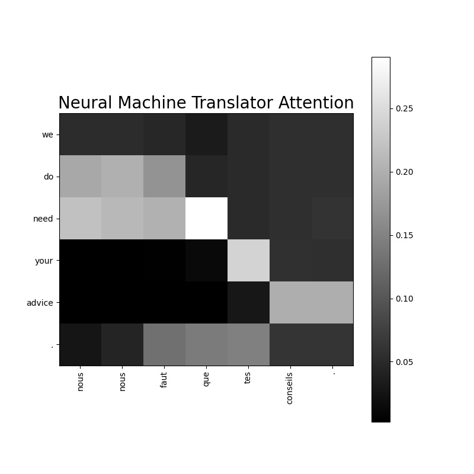<br><br><br>

* Model without Attention
    ```
    # Sample 1
    src : tom asked mary for some help .
    gt  : tom a demande a mary de l'aider .
    pred: tom demande demande a mary de l'aide .


    # Sample 2
    src : you see what i mean ?
    gt  : tu vois ce que je veux dire ?
    pred: tu vois ce que je veux dire ?


    # Sample 3
    src : i haven't talked to you in a while .
    gt  : je ne t'ai pas parle depuis un bon moment .
    pred: je n'ai vous pas parle pendant un moment moment .

    ```
    <br><br>

* Scheduled Sampling Model without Attention
    ```
    # Sample 1
    src : let's take a little break .
    gt  : faisons une petite pause .
    pred: faisons une pause pause .


    # Sample 2
    src : they live on the [UNK] floor of this [UNK] .
    gt  : ils vivent au [UNK] etage de ces [UNK] .
    pred: ils vivent au sujet de de ce sujets .


    # Sample 3
    src : tom doesn't understand why mary is so popular .
    gt  : tom ne comprend pas pourquoi marie est si populaire .
    pred: tom ne comprend pas pourquoi mary est si populaire .

    ```
    <br><br>


<br><br><br>
