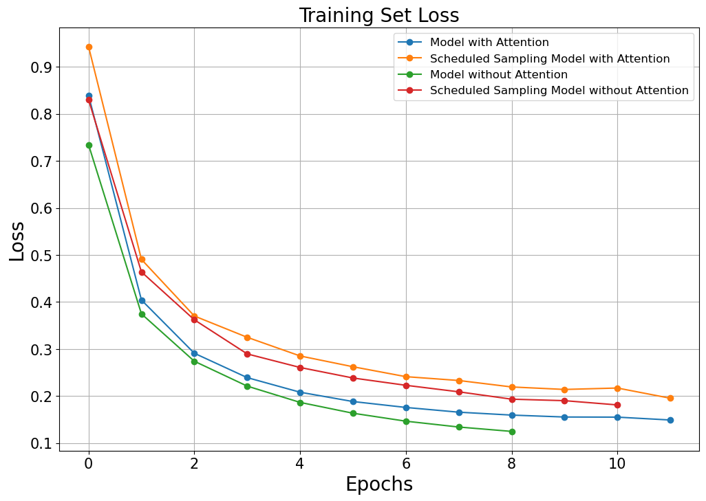
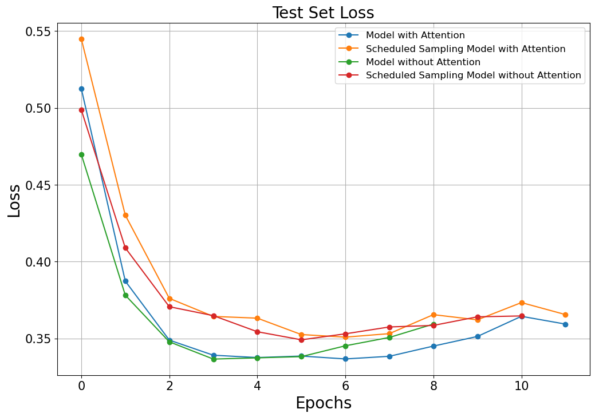
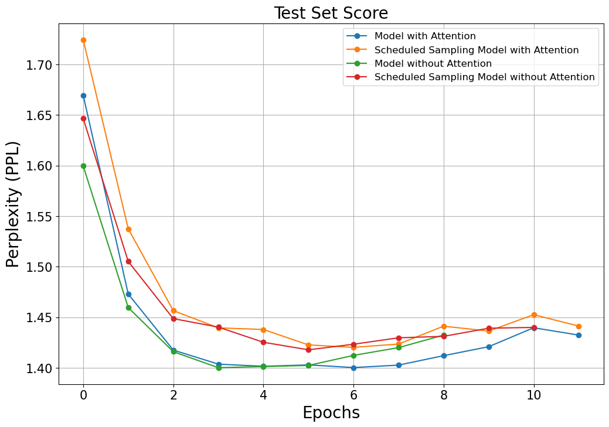
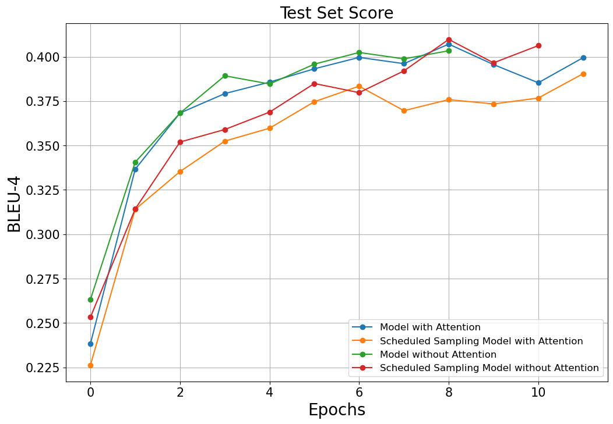
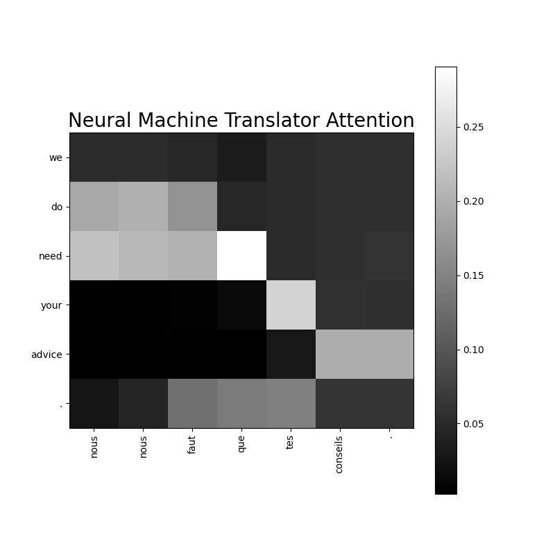

# Neural Machine Translator GRU

## Introduction
Tatoeba Project의 English-French 문장 쌍 데이터를 사용하여 GRU 기반의 기계 번역 모델을 제작합니다.
본 코드에서는 attention과 [scheduled sampling](https://arxiv.org/pdf/1506.03099.pdf) 사용 유무 따른 기계 번역 모델을 제작할 수 있습니다.
GRU 기반 기계 번역 모델과 이 모델의 attention에 대한 설명은 [Sequence-to-Sequence (Seq2Seq) 모델과 Attention](https://ljm565.github.io/contents/RNN2.html)을 참고하시기 바랍니다.
또한 본 코드의 attention은 [Bahdanau Attention](https://arxiv.org/pdf/1409.0473.pdf)을 기반으로 구현하였으며, PyTorch의 [seq2seq 튜토리얼](https://tutorials.pytorch.kr/intermediate/seq2seq_translation_tutorial.html)과는 무관합니다.
다른 attention을 사용한 모델을 보고 싶다면 [seq2seq 튜토리얼](https://tutorials.pytorch.kr/intermediate/seq2seq_translation_tutorial.html) 코드를 참고하시기 바랍니다.
<br><br><br>

## Supported Models
### Seqeunce-to-Sequence GRU Model and Attention
* `nn.GRU`를 이용한 GRU 모델이 구현되어 있습니다.
* Bahdanau Attention이 구현되어 있습니다(`config/config.yaml`에서 사용 여부 선택 가능).
<br><br><br>

## Supported Tokenizer
### Custom Word Tokenizer
* 단어 기준으로 토큰화(Attention 가시화를 위함).
<br><br><br>

## Base Dataset
* 실험으로 사용하는 데이터는 [Tatoeba Project](https://www.manythings.org/anki/)의 sentence pair 데이터 중, English-French 데이터셋입니다.
<br><br><br>

## Supported Devices
* CPU, GPU, multi-GPU (DDP), MPS (for Mac and torch>=1.12.0)
<br><br><br>

## Quick Start
```bash
python3 src/run/train.py --config config/config.yaml --mode train
```
<br><br>

## Project Tree
본 레포지토리는 아래와 같은 구조로 구성됩니다.
```
├── configs                           <- Config 파일들을 저장하는 폴더
│   └── *.yaml
│
└── src      
    ├── models
    |   └── gru_seq2seq.py            <- GRU 모델 파일
    |
    ├── run                   
    |   ├── inference.py              <- 학습된 모델 live demo 실행 코드
    |   ├── train.py                  <- 학습 실행 파일
    |   ├── validation.py             <- 학습된 모델 평가 실행 파일
    |   └── vis_attention.py          <- 단어별 attention 가시화 코드
    |
    ├── tools                   
    |   ├── tokenizers
    |   |    └── word_tokenizer.py    <- 단어 토크나이저 파일
    |   |
    |   ├── early_stopper.py          <- Early stopper class 파일
    |   ├── evaluator.py              <- Metric evaluator class 파일
    |   ├── model_manager.py          
    |   ├── tatoeba_downloader.py     <- Tatoeba 데이터 전처리 파일
    |   └── training_logger.py        <- Training logger class 파일
    |
    ├── trainer                 
    |   ├── build.py                  <- Dataset, dataloader 등을 정의하는 파일
    |   └── trainer.py                <- 학습, 평가 등을 수행하는 class 파일
    |
    └── uitls                   
        ├── __init__.py               <- Logger, 버전 등을 초기화 하는 파일
        ├── data_utils.py             <- Dataloader 정의 파일
        ├── filesys_utils.py       
        ├── func_utils.py       
        └── training_utils.py     
```
<br><br>

## Tutorials & Documentations
GRU 기계 번역 모델을 학습하기 위해서 다음 과정을 따라주시기 바랍니다.
1. [Getting Started](./1_getting_started_ko.md)
2. [Data Preparation](./2_data_preparation_ko.md)
3. [Training](./3_trainig_ko.md)
4. ETC
   * [Evaluation](./4_model_evaluation_ko.md)
   * [Attention Visualization](./5_vis_attn_ko.md)
   * [Live Demo](./6_live_demo_ko.md)

<br><br><br>


## Training Results
### Each Result of GRU Neural Machine Translator
* Training Set Loss History<br>
    <br><br>

* Test Set Loss History<br>
    <br>
    * Model with Attention: 0.3367
    * Scheduled Sampling Model with Attention: 0.3509
    * Model without Attention: 0.3366
    * Scheduled Sampling Model without Attention: 0.3491<br><br>

* Test Set Perplexity (PPL) History<br>
    <br>
    * Model with Attention: 1.4003
    * Scheduled Sampling Model with Attention: 1.4203
    * Model without Attention: 1.4002
    * Scheduled Sampling Model without Attention: 1.4178<br><br>

* BLEU-2 Score History<br>
    <br>
    * Model with Attention: 0.5789
    * Scheduled Sampling Model with Attention: 0.5646
    * Model without Attention: 0.5735
    * Scheduled Sampling Model without Attention: 0.5656<br><br>

* BLEU-4 Score History<br>
    <br>
    * Model with Attention: 0.3996
    * Scheduled Sampling Model with Attention: 0.3834
    * Model without Attention: 0.3893
    * Scheduled Sampling Model without Attention: 0.3849<br><br>

* NIST-2 Score History<br>
    <br>
    * Model with Attention: 6.8475
    * Scheduled Sampling Model with Attention: 6.6922
    * Model without Attention: 6.8016
    * Scheduled Sampling Model without Attention: 6.7098<br><br>

* NIST-4 Score History<br>
    <br>
    * Model with Attention: 7.1627
    * Scheduled Sampling Model with Attention: 7.0052
    * Model without Attention: 7.1178
    * Scheduled Sampling Model without Attention: 7.0177<br><br>


### Translated Samples and Attentions of Each GRU Model
* Model with Attention
    ```
    # Sample 1
    src : when i was your age , i had a girlfriend .
    gt  : lorsque j'avais votre age , j'avais une petite amie .
    pred: lorsque j'avais votre age , j'avais une petite amie .


    # Sample 2
    src : he gave me some money .
    gt  : il me donna un peu d'argent .
    pred: il me donna un peu d'argent .


    # Sample 3
    src : please answer all the questions .
    gt  : repondez a toutes les questions , s'il vous plait .
    pred: repondez a toutes les questions , s'il vous plait .

    ```
    
    
    <br><br><br>

* Scheduled Sampling Model with Attention
    ```
    # Sample 1
    src : i'm in love with you and i want to marry you .
    gt  : je suis amoureuse de toi et je veux me marier avec toi .
    pred: je vous amoureux de toi et je veux vous epouser . toi .


    # Sample 2
    src : what's really going one here ?
    gt  : que se passe-t-il vraiment ici ?
    pred: que se passe-t-il, ici ?


    # Sample 3
    src : we do need your advice .
    gt  : il nous faut ecouter vos conseils .
    pred: nous nous faut que tes conseils .

    ```
    
    
    <br><br><br>

* Model without Attention
    ```
    # Sample 1
    src : tom asked mary for some help .
    gt  : tom a demande a mary de l'aider .
    pred: tom demande demande a mary de l'aide .


    # Sample 2
    src : you see what i mean ?
    gt  : tu vois ce que je veux dire ?
    pred: tu vois ce que je veux dire ?


    # Sample 3
    src : i haven't talked to you in a while .
    gt  : je ne t'ai pas parle depuis un bon moment .
    pred: je n'ai vous pas parle pendant un moment moment .

    ```
    <br><br>

* Scheduled Sampling Model without Attention
    ```
    # Sample 1
    src : let's take a little break .
    gt  : faisons une petite pause .
    pred: faisons une pause pause .


    # Sample 2
    src : they live on the [UNK] floor of this [UNK] .
    gt  : ils vivent au [UNK] etage de ces [UNK] .
    pred: ils vivent au sujet de de ce sujets .


    # Sample 3
    src : tom doesn't understand why mary is so popular .
    gt  : tom ne comprend pas pourquoi marie est si populaire .
    pred: tom ne comprend pas pourquoi mary est si populaire .

    ```
    <br><br>


<br><br><br>
